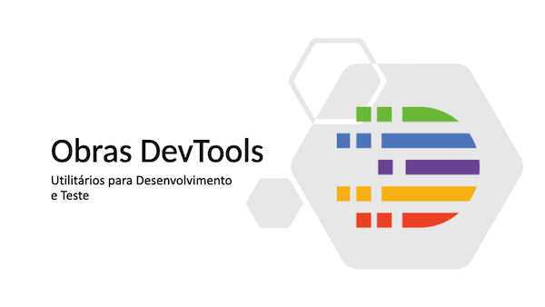

```mermaid
%% State diagram with emoticons and pastel colors
stateDiagram-v2
  state "🚀 Project Init" as ProjectInit
  state "🏢 Site Selection" as SiteSelection
  state "⚙️ Config Loading" as ConfigLoading
  state "🌱 Environment Setup" as EnvironmentSetup
  state "🔍 Services Check" as ServicesCheck
  state "▶️ Services Start" as ServicesStart
  state "🗄️ Database Ready" as DatabaseReady
  state "💻 Development Mode" as DevelopmentMode
  state "🧪 Testing" as Testing
  state "🧹 Code Quality" as CodeQuality
  state "🗄️ Database Ops" as DatabaseOps
  state "🔧 Service Ops" as ServiceOps
  state "🧹 Cleanup" as Cleanup

  [*] --> ProjectInit
  ProjectInit --> SiteSelection: init_obras
  SiteSelection --> ConfigLoading: site [name]
  ConfigLoading --> EnvironmentSetup
  EnvironmentSetup --> ServicesCheck: Check dependencies
  ServicesCheck --> ServicesStart: Start required services
  ServicesStart --> DatabaseReady: DB initialization
  DatabaseReady --> DevelopmentMode: site start
  DevelopmentMode --> Testing: site test
  DevelopmentMode --> CodeQuality: site audit/rubocop
  DevelopmentMode --> DatabaseOps: site db [command]
  DevelopmentMode --> ServiceOps: site services [command]
  Testing --> DevelopmentMode: Continue development
  CodeQuality --> DevelopmentMode: Apply fixes
  DatabaseOps --> DevelopmentMode: Return to coding
  ServiceOps --> DevelopmentMode: Resume work
  DevelopmentMode --> Cleanup: site stop
  Cleanup --> [*]: Environment shutdown

  note right of ServicesCheck
    🛢️ MySQL, 🧊 Redis,
    📧 Mailcatcher, 🦾 Sidekiq
  end note
  note right of DatabaseOps
    🔄 Migrations, 🌱 Seeds,
    💾 Backups, 📦 Dumps
  end note
```

# **Project Automation Devenv**

[Homepage](https://github.com/enogrob/bash-automation-devenv)


## Contents

- [Summary](#summary)
- [Architecture](#architecture)
  - [Key Concepts](#key-concepts)
  - [Alternative Perspectives](#alternative-perspectives)
- [Tech Stack](#tech-stack)
- [Getting Started](#getting-started)
- [Usage Examples](#usage-examples)
- [Contributing Guidelines](#contributing-guidelines)
- [Troubleshooting](#troubleshooting)
- [License](#license)
- [References](#references)

## Summary

The Bash Automation Devenv (originally "Research Obras DevTools") is a comprehensive development automation toolkit designed to streamline Ruby on Rails development workflows. Created by Roberto Nogueira for improving the "Obras" development process, this project provides utilities and support for containerized development environments using Docker, along with seamless integration for popular editors like VS Code and RubyMine.

The toolkit serves as a centralized command-line interface that automates common development tasks including database management, service orchestration, testing workflows, and deployment processes. It particularly excels in managing multi-site Rails applications where developers need to quickly switch between different project configurations and database states. The system provides intelligent automation for database dumps, backups, service status monitoring, and development environment setup.

Target users include Ruby on Rails developers working on multi-tenant applications, development teams requiring standardized tooling across different environments, and DevOps engineers seeking to automate repetitive development tasks. The project demonstrates advanced bash scripting techniques for creating professional development toolchains and serves as an excellent reference for building custom automation solutions in enterprise development environments.

<br/>

<div align="center">
  <a href="resources/obras-devtools.pptx" target="_blank">
    
  </a>
</div>

<br/>


## Architecture

```mermaid
%% Mermaid diagram with emoticons and pastel colors
graph TD
  classDef pastelBlue fill:#dbeafe,stroke:#60a5fa,stroke-width:2px,color:#1e293b;
  classDef pastelGreen fill:#dcfce7,stroke:#4ade80,stroke-width:2px,color:#166534;
  classDef pastelPink fill:#fce7f3,stroke:#f472b6,stroke-width:2px,color:#831843;
  classDef pastelYellow fill:#fef9c3,stroke:#fde047,stroke-width:2px,color:#92400e;
  classDef pastelPurple fill:#ede9fe,stroke:#a78bfa,stroke-width:2px,color:#4c1d95;
  classDef pastelGray fill:#f3f4f6,stroke:#9ca3af,stroke-width:2px,color:#374151;

  A["🛠️ obras_utils Core"]:::pastelBlue --> B["🏢 Site Management"]:::pastelGreen
  A --> C["🔧 Service Management"]:::pastelPink
  A --> D["🗄️ Database Management"]:::pastelYellow
  A --> E["🧪 Development Tools"]:::pastelPurple

  subgraph "Site Operations 🏢"
    B --> F["🔀 Site Selection"]:::pastelGreen
    B --> G["⚙️ Environment Config"]:::pastelGreen
    B --> H["🚂 Rails Commands"]:::pastelGreen
  end

  subgraph "Service Layer 🔧"
    C --> I["🛢️ MySQL Service"]:::pastelPink
    C --> J["🧊 Redis Service"]:::pastelPink
    C --> K["📧 Mailcatcher"]:::pastelPink
    C --> L["🦾 Sidekiq Workers"]:::pastelPink
    C --> M["🌐 NGrok Tunneling"]:::pastelPink
  end

  subgraph "Data Layer 🗄️"
    D --> N["🆕 Database Creation"]:::pastelYellow
    D --> O["🔄 Migration Management"]:::pastelYellow
    D --> P["💾 Backup/Restore"]:::pastelYellow
    D --> Q["📦 Dump Management"]:::pastelYellow
    D --> R["🔌 Connection Tools"]:::pastelYellow
  end

  subgraph "Development Environment 🧪"
    E --> S["🧹 Code Quality Tools"]:::pastelPurple
    E --> T["🧪 Testing Framework"]:::pastelPurple
    E --> U["🔀 Git Integration"]:::pastelPurple
    E --> V["📝 Editor Support"]:::pastelPurple
  end

  subgraph "External Integrations 🌐"
    W["🐳 Docker Container"]:::pastelGray --> A
    X["☁️ Engine Yard Cloud"]:::pastelGray --> P
    Y["📋 Trello CLI"]:::pastelGray --> E
    Z["🐙 GitHub Repositories"]:::pastelGray --> U
  end

  A --> AA["🖥️ Terminal Interface"]:::pastelBlue
  AA --> BB["⏳ Progress Indicators"]:::pastelBlue
  AA --> CC["❗ Error Handling"]:::pastelBlue
  AA --> DD["❓ Help System"]:::pastelBlue
```



### Alternative Perspectives

<details>
<summary><strong>1. Class Diagram - Structural Relationships</strong> (Click to expand)</summary>


</details>

<details>
<summary><strong>2. Journey Process - State Transitions</strong> (Click to expand)</summary>



</details>

<details>
<summary><strong>3. Mind Map - Interconnected Themes</strong> (Click to expand)</summary>



</details>

```mermaid
%% Mind map with emoticons and pastel colors
mindmap
  root((🛠️ Bash Automation Devenv))
    Site_Management[🏢 Site Management]
      MultiTenant[🌐 Multi-tenant Support]
      EnvSwitch[🔀 Environment Switching]
      ConfigMgmt[⚙️ Configuration Management]
      RailsInt[🚂 Rails Integration]
    Service_Orch[🔧 Service Orchestration]
      MySQL[🛢️ MySQL Database]
      Redis[🧊 Redis Cache]
      Mailcatcher[📧 Mailcatcher SMTP]
      Sidekiq[🦾 Sidekiq Background Jobs]
      NGrok[🌐 NGrok Tunneling]
      Docker[🐳 Docker Containers]
    Database_Ops[🗄️ Database Operations]
      SchemaMig[🔄 Schema Migrations]
      DataSeed[🌱 Data Seeding]
      Backup[💾 Backup Management]
      Dump[📦 Dump Import/Export]
      ConnTools[🔌 Connection Tools]
      EYard[☁️ Engine Yard Integration]
    Dev_Workflow[💻 Development Workflow]
      CodeQual[🧹 Code Quality Analysis]
        Rubocop[🧼 Rubocop Linting]
        Brakeman[🛡️ Brakeman Security]
        RubyCritic[📊 RubyCritic Metrics]
        TestCov[🧪 Test Coverage]
      TestFW[🧪 Testing Framework]
        RSpec[🧪 RSpec Tests]
        SysTest[🖥️ System Tests]
        TestEnv[🌱 Test Environment Setup]
      VCS[🔀 Version Control]
        GitInt[🐙 Git Integration]
        RepoMgmt[📁 Repository Management]
        BranchOps[🌿 Branch Operations]
    EditorInt[📝 Editor Integration]
      VSCode[🖥️ VS Code Support]
      RubyMine[💎 RubyMine Support]
      ConfigFiles[📄 Configuration Files]
      ExtMgmt[🧩 Extension Management]
    Automation[🤖 Automation Features]
      Progress[⏳ Progress Indicators]
      Spinner[🌀 Spinner Animations]
      Error[❗ Error Handling]
      Help[❓ Help Documentation]
      Update[⬆️ Update Management]
```

### Key Concepts

* **Site Management**: Multi-tenant application support allowing developers to switch between different project configurations (olimpia, rioclaro, suzano, santoandre, etc.) with isolated environments and database states
* **Service Orchestration**: Automated management of development services including MySQL, Redis, Mailcatcher, Sidekiq workers, and NGrok tunneling with intelligent start/stop/restart capabilities
* **Database Operations**: Comprehensive database lifecycle management including creation, migration, seeding, backup/restore operations, and integration with Engine Yard cloud backups
* **Environment Isolation**: Containerized development environments using Docker with seamless integration between host and container processes
* **Progress Visualization**: Advanced terminal UI with progress bars, spinners, and colored output using ANSI library for enhanced user experience
* **Code Quality Integration**: Built-in support for Ruby code quality tools including Rubocop, Brakeman security scanner, RubyCritic metrics, and test coverage reporting
* **Multi-Platform Support**: Cross-platform compatibility for both macOS and Linux development environments with OS-specific optimizations
* **Intelligent Automation**: Context-aware commands that adapt behavior based on current project state, available services, and system configuration
* **Development Workflow**: Streamlined Rails development process with automated testing, database management, and deployment preparation
* **Editor Integration**: Pre-configured setups for popular IDEs including VS Code and RubyMine with optimized development configurations

## Tech Stack

* **Programming Language**: Bash shell scripting (primary), Ruby (target applications)
* **Framework**: Ruby on Rails applications (versions 6.0+), Foreman process management
* **Libraries/Dependencies**: 
  - ANSI library for terminal styling and colors
  - Revolver for spinner animations and progress indicators
  - Pipe Viewer (pv) for progress visualization
  - mycli for enhanced MySQL command-line interface
  - iredis for Redis command-line interface
* **Build Tools**: Foreman for process management, RVM for Ruby version management
* **Testing Framework**: RSpec for unit testing, Rails system tests for integration testing
* **Database**: MySQL (primary), Redis (caching and background jobs)
* **Deployment**: Engine Yard cloud platform, Docker containerization
* **CI/CD**: Git-based workflows with automated testing and deployment hooks
* **Development Tools**: 
  - VS Code with Rails extensions
  - RubyMine IDE with custom configurations
  - Git with enhanced prompt and completion
  - NGrok for secure tunneling
* **Version Control**: Git with GitHub integration, SSH key management
* **Documentation**: Markdown documentation, inline help system
* **Monitoring**: 
  - Mailcatcher for email testing
  - Sidekiq for background job monitoring
  - Custom service status checking
* **Security**: 
  - Brakeman security scanner
  - SSH key automation
  - Secure database connection management

## Getting Started

### System Requirements

Before installing Bash Automation Devenv, ensure the following dependencies are installed:

1. **Git with completion and prompt support**:
```bash
sudo apt-get install git-core bash-completion
git config --global user.email <your-email>
git config --global user.name <your-name>
```

2. **SSH Key Setup** (for repository access):
```bash
ssh-keygen -o -f ~/.ssh/id_rsa
sudo apt-get install xclip
xclip -selection clipboard < ~/.ssh/id_rsa.pub
```

3. **Sudo without password** (required for netstat operations):
```bash
sudo visudo
# Add: <username> ALL=(ALL) NOPASSWD:ALL
```

4. **RVM (Ruby Version Manager)**:
```bash
curl -sSL https://rvm.io/mpapis.asc | gpg --import -
curl -sSL https://rvm.io/pkuczynski.asc | gpg --import -
\curl -sSL https://get.rvm.io | bash -s stable
source ~/.rvm/scripts/rvm
```

5. **Required Services**:
```bash
# MySQL
sudo apt-get install mysql-server
sudo service mysql start

# Redis
sudo apt-get install redis-server
sudo service redis-server start

# Docker
sudo apt-get install docker-ce docker-compose
sudo usermod -aG docker $USER
```

### Installation

1. **Clone and configure the project**:
```bash
git clone https://github.com/enogrob/bash-automation-devenv.git
cd bash-automation-devenv
```

2. **Run the installation script**:
```bash
chmod +x install.sh
./install.sh obras_dir $HOME/Projects/obras $HOME/Projects/obras_old
```

3. **Source the utilities in your shell**:
```bash
echo 'source $HOME/.obras_utils.sh' >> ~/.bashrc
source ~/.bashrc
```

4. **Initialize the development environment**:
```bash
init_obras
```

### Verification

Verify successful installation by running:
```bash
obras_utils --version
site --help
```

## Usage Examples

### Basic Site Management

**Switch to a specific site and start development**:
```bash
# Navigate to a specific site
santoandre
# or
site santoandre

# Start the development environment
site start

# Check running services
site
```

<br/>

<div align="center">
    
</div>

<br/>

**Output**: Displays running processes, database status, and available services with color-coded status indicators.

### Database Operations

**Initialize and manage databases**:
```bash
# Create and setup a new database
site db create
site db migrate
site db seed

# Import production data dump
site db dumps
site db import [dumpfile]

# Backup current database
site db backup
```

**Example**: `site db import obras_2024_backup.sql` imports a specific database dump with progress visualization.

### Service Management

**Control development services**:
```bash
# Start all services
site services start all

# Start specific services
site services start mysql redis mailcatcher

# Check service status
site services status

# Stop services
site services stop sidekiq
```

**Output**: Each command provides real-time status updates with progress indicators and service health checks.

### Code Quality and Testing

**Run quality checks and tests**:
```bash
# Run security audit
site audit

# Check code style
site rubocop

# Generate code metrics
site rubycritic

# Run test suite
site test
site rspec
```

**Example**: `site audit` runs Brakeman security scanner and displays vulnerabilities with severity ratings and fix recommendations.

### Advanced Workflows

**Database synchronization with production**:
```bash
# Download latest backup from Engine Yard
site db backups
site db download

# Update local database with fresh data
site db update all
```

**Multi-environment testing**:
```bash
# Setup test environment
site db preptest

# Run system tests
site test:system

# Generate coverage report
site stats
```

## Contributing Guidelines

The Bash Automation Devenv project follows standard open-source contribution practices:

### Development Workflow

1. **Fork the repository** and create a feature branch
2. **Follow bash scripting best practices**:
   - Use proper error handling with `set -e`
   - Include function documentation
   - Maintain POSIX compatibility where possible
3. **Test your changes** across supported platforms (macOS and Linux)
4. **Update version numbers** in `.obras_utils.sh` for new releases
5. **Document new features** in the README and help system

### Coding Standards

- Use consistent indentation (2 spaces)
- Include error checking for all external dependencies
- Provide progress feedback for long-running operations
- Follow the existing naming conventions for functions and variables
- Add appropriate ANSI color coding for terminal output

### Testing Requirements

- Test all database operations with sample data
- Verify service management across different system states
- Ensure cross-platform compatibility
- Test installation and update procedures

### Submitting Changes

1. Create detailed commit messages explaining the changes
2. Include version bump and changelog updates
3. Test the installation script with clean environments
4. Submit pull requests with clear descriptions of improvements

## Troubleshooting

### Common Issues and Solutions

**Q: "Access denied for user root@localhost" when connecting to MySQL**
```bash
sudo mysql -u root
mysql> use mysql;
mysql> update user set plugin='mysql_native_password' where User='root';
mysql> flush privileges;
```

**Q: Services fail to start with permission errors**
```bash
# Ensure user is in docker group
sudo usermod -aG docker $USER
# Restart shell session
```

**Q: Site command not found after installation**
```bash
# Verify bashrc sourcing
source ~/.bashrc
# Check if obras_utils is loaded
obras_utils --version
```

**Q: Database dumps fail to download**
- Verify SSH keys are registered in Engine Yard
- Check network connectivity
- Ensure sufficient disk space

### Debugging Tips

- Use `site --help` for command syntax
- Check service logs in `tmp/devtools/`
- Verify environment variables with `env | grep OBRAS`
- Test individual services with `site services status`

### Getting Help

- Review the comprehensive help system: `obras_utils --help`
- Check service-specific help: `site services --help`
- Examine database operations: `site db --help`
- For updates and new features: `obras_utils check`

## License

This project is crafted by InMov - Intelligence in Movement (2013-2020) under Roberto Nogueira. The specific license terms are not explicitly stated in the project files, but the project appears to be open-source given its GitHub hosting and collaborative development approach.

## References

* [Research Obras DevTools on GitHub](https://github.com/enogrob/research-obras-devtools) - Main project repository containing the core utilities and documentation
* [Obras Devtools Presentation - key](resources/obras-devtools.key) - Utilities for Development and Testing
* [Obras Devtools Presentation - pptx](resources/obras-devtools.pptx) - Utilities for Development and Testing
* [Pipe Viewer (pv)](http://www.ivarch.com/programs/pv.shtml) - Progress visualization tool used for monitoring long-running operations and data transfer
* [ANSI Library](https://github.com/fidian/ansi) - Terminal styling and color library providing enhanced user interface capabilities
* [Revolver](https://github.com/molovo/revolver) - Spinner and progress indicator library for terminal applications
* [Z Shell Documentation](http://zsh.sourceforge.net/) - Advanced shell features and scripting capabilities reference
* [Foreman Process Manager](https://github.com/ddollar/foreman) - Application process management tool for development environments
* [Docker Documentation](https://www.docker.com/) - Containerization platform for consistent development environments
* [VS Code](https://code.visualstudio.com/) - Integrated development environment with Rails extensions
* [RubyMine](https://www.jetbrains.com/ruby/) - Professional Ruby and Rails IDE with advanced debugging capabilities
* [NGrok](https://ngrok.com/) - Secure tunneling service for exposing local development servers
* [mycli](https://github.com/dbcli/mycli) - Enhanced MySQL command-line client with auto-completion and syntax highlighting
* [iredis](https://iredis.io/) - Interactive Redis client with improved terminal interface
* [Trello CLI (3llo)](https://github.com/qcam/3llo) - Command-line interface for Trello project management integration
* [tig](https://github.com/jonas/tig) - Text-mode interface for Git providing enhanced repository browsing
* [Mailcatcher](https://github.com/sj26/mailcatcher) - Simple SMTP server for email testing in development environments

